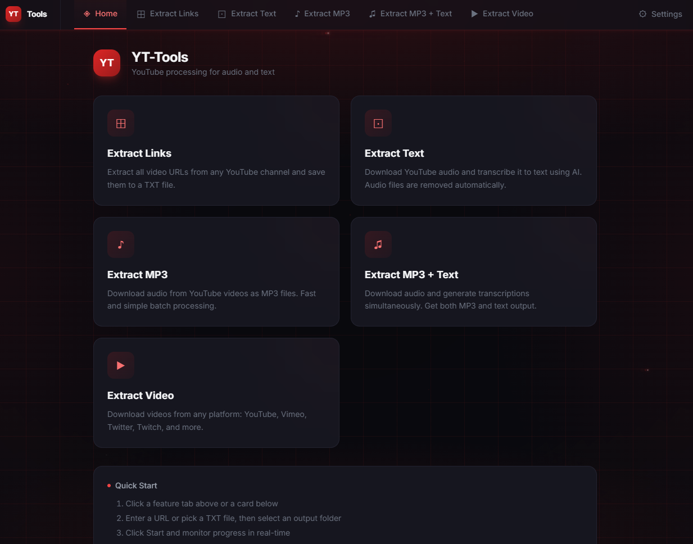

# YT-Tools v1.0

A modern desktop application for extracting YouTube audio and generating transcriptions. Built with React + Electron + Python.


---



---

## Features

- ✓ **Local transcription with Faster Whisper** — runs entirely on your machine, no cloud upload, no API keys
- ✓ **No cloud API required** — no monthly bills, no rate limits, no data leaves your PC
- ✓ **Automatic cleanup** — temporary audio files are removed after transcription
- ✓ **Markdown export** — every `.txt` transcript comes with an identical `.md` sibling
- ✓ **Batch processing** — process multiple videos from a channel or URL list in one go
- ✓ **Real-time progress** — live logs and progress bars for every task
- ✓ **Electron desktop app** — native Windows experience with drag-and-drop, file pickers, persistent settings

---

## Architecture

```
┌──────────────────────────────────────────────────┐
│                  Electron Shell                   │
│  ┌────────────────────────────────────────────┐  │
│  │          Main Process (main.js)             │  │
│  │  ┌──────────┐   ┌───────────────┐         │  │
│  │  │ IPC Route │   │ Python Proc   │         │  │
│  │  │ Handlers  │   │ Manager       │         │  │
│  │  └─────┬────┘   └───────┬───────┘         │  │
│  └────────┼────────────────┼──────────────────┘  │
│           │ IPC             │ child_process       │
│  ┌────────┼────────────────┼──────────────────┐  │
│  │  ▼     │                ▼                  │  │
│  │  Renderer (React + Vite + TailwindCSS)     │  │
│  │  ┌──────────┐ ┌────────┐ ┌─────────────┐  │  │
│  │  │ Zustand  │ │ Pages  │ │ Components  │  │  │
│  │  └──────────┘ └────────┘ └─────────────┘  │  │
│  └────────────────────────────────────────────┘  │
│                                                   │
│  ┌────────────────────────────────────────────┐  │
│  │        Python Child Process                 │  │
│  │  JSON-line protocol via stdout:             │  │
│  │  {"type":"progress","current":1,"total":5}  │  │
│  │  {"type":"log","level":"info","message":""} │  │
│  └────────────────────────────────────────────┘  │
└──────────────────────────────────────────────────┘
```

### Communication Flow

1. User clicks **Start** in the React UI
2. Renderer sends IPC message to Electron main process
3. Main process spawns `python <script> --args` as a child process
4. Python writes JSON progress lines to stdout
5. Main process reads stdout line-by-line, forwards to renderer via IPC
6. Renderer updates Zustand store → React re-renders progress/logs

---

## Project Structure

```
yt-tools/
├── electron/                    # Electron main process
│   ├── main.cjs                 # IPC handlers, Python process management
│   └── preload.cjs              # Context bridge (exposes electronAPI to renderer)
├── src/                         # React frontend (Vite + TypeScript)
│   ├── components/              # Reusable UI components
│   │   ├── Layout.tsx           # App shell with NavTabs + persistent panels
│   │   ├── NavTabs.tsx          # Horizontal tab navigation
│   │   ├── TaskPage.tsx         # Unified task form (url, file, folder)
│   │   ├── FeatureCard.tsx      # Dashboard card with hover glow
│   │   ├── ProgressPanel.tsx    # Green gradient progress bar + cancel
│   │   ├── LogViewer.tsx        # Scrollable log display with empty state
│   │   ├── FileDropZone.tsx     # Drag-and-drop + file picker
│   │   ├── FolderPicker.tsx     # Folder selection button
│   │   └── ErrorBoundary.tsx    # Error boundary wrapper
│   ├── pages/                   # Route pages
│   │   ├── HomePage.tsx         # Dashboard with 4 feature cards
│   │   ├── ExtractLinksPage.tsx  # Feature 1
│   │   ├── ExtractTextPage.tsx   # Feature 2
│   │   ├── ExtractMp3Page.tsx    # Feature 3
│   │   ├── ExtractMp3AndTextPage.tsx  # Feature 4
│   │   └── SettingsPage.tsx     # Whisper + general settings
│   ├── hooks/
│   │   └── useTaskForm.ts       # Shared form state hook
│   ├── stores/
│   │   └── useStore.ts          # Zustand store (settings + task state)
│   ├── types/
│   │   └── index.ts             # TypeScript interfaces
│   ├── App.tsx                  # Router setup with ErrorBoundary
│   ├── main.tsx                 # Entry point
│   └── index.css                # Tailwind + custom styles
├── python/                      # Python wrapper scripts (zero-duplication)
│   ├── shared.py                # ALL reusable logic (naming, logging, Whisper, yt-dlp)
│   ├── extract_links.py         # Wrapper for get_links_youtube.py
│   ├── extract_text.py          # Wrapper for multy_transcriber_1Folder.py
│   ├── download_mp3.py          # Wrapper for simple_multi_download.py
│   ├── transcribe_mp3_text.py   # Wrapper for simple_multi_transcriber_Faster_Whispe.py
│   └── requirements.txt         # Python dependencies
├── get_links_youtube.py         # Original scripts (kept as-is)
├── multy_transcriber_1Folder.py
├── simple_multi_download.py
├── simple_multi_transcriber_Faster_Whispe.py
├── logs/                        # Auto-generated log files
├── package.json                 # Electron + build scripts
├── vite.config.ts               # Vite bundler config
├── tailwind.config.cjs          # Custom dark theme (metallic red + black)
├── postcss.config.cjs           # PostCSS config
├── tsconfig.json
└── .gitignore
```

---

## Development

### Prerequisites

- Node.js 18+
- Python 3.8+
- yt-dlp (`pip install yt-dlp`)
- faster-whisper (`pip install faster-whisper`)

### Setup & Run

```bash
npm install
pip install -r python/requirements.txt
npm run electron:dev
```

Starts Vite dev server + loads Electron window automatically.

---

## Download

[Download latest portable exe](https://github.com/EugeRuy/yt-tools/releases/latest/download/YT-Tools-1.0.0-portable.exe)

No installation required — just download and run. Requires Python 3.8+ with:
```bash
pip install yt-dlp faster-whisper
```

## Building from Source

```bash
npm install
pip install -r python/requirements.txt
npm run electron:build
```

Creates `release/YT-Tools-*-portable.exe`.

---

## Settings

| Setting | Default | Description |
|---------|---------|-------------|
| Default Output Folder | (empty) | Pre-filled folder path on all pages |
| Whisper Model | `small` | Model size: `tiny`, `base`, `small`, `medium`, `large-v3` |
| Device | `cpu` | `cpu` or `cuda` (NVIDIA GPU) |
| Compute Type | `int8` | Quantization: `int8`, `float16`, `int8_float16` |
| Beam Size | `5` | Beam search size for transcription |
| Max Parallel Jobs | `1` | Reserved for future parallel processing |

---

## Output Naming Convention

All generated files follow: `{channel-name}-{video-title}.{ext}`

Examples:
- Channel: `Filosofía Pepe` → slug: `filosofia-pepe`
- Title: `Historia de Platón` → slug: `historia-de-platon`
- Filename: `filosofia-pepe-historia-de-platon.txt`
- Every `.txt` file is accompanied by an identical `.md` file

---

## Reusable Code Architecture

The Python codebase follows a **zero-duplication** architecture:

```
shared.py (ALL reusable logic)
├── emit_json() / log() / progress() / error() / complete()
├── build_filename()
├── get_video_metadata(url) → (channel, title)
├── download_audio(url, output_dir)
├── find_audio_file(directory)
├── write_text_and_markdown(content, base_path)
├── load_whisper_model()
├── transcribe_audio(path, model)
├── delete_file(path)
├── read_url_list(file_path)
└── write_links_file(urls, output_path, channel_name)

Wrappers (~40-60 lines each):
├── extract_links.py
├── extract_text.py
├── download_mp3.py
└── transcribe_mp3_text.py

Original scripts (untouched):
├── get_links_youtube.py
├── multy_transcriber_1Folder.py
├── simple_multi_download.py
└── simple_multi_transcriber_Faster_Whispe.py
```

---

## IPC Protocol

### Messages: Renderer → Main

| Channel | Payload | Description |
|---------|---------|-------------|
| `task:start` | `{type, params}` | Start a Python task |
| `task:cancel` | — | Kill the running process |
| `dialog:openFile` | `{filters}` | Open native file picker |
| `dialog:openFolder` | — | Open native folder picker |
| `settings:get` | — | Retrieve all settings |
| `settings:set` | `{key: value}` | Update settings |

### Messages: Main → Renderer

| Channel | Payload | Description |
|---------|---------|-------------|
| `python:message` | `{type, ...}` | Forward JSON from Python |

### Python JSON-line protocol

Every line written to stdout by a Python script must be a JSON object:

```json
{"type":"start","message":"Task started"}
{"type":"progress","current":1,"total":10,"message":"Processing 1/10"}
{"type":"log","level":"info","message":"Downloading audio..."}
{"type":"error","message":"Failed to fetch title"}
{"type":"complete","success":true,"output_path":"C:/output","message":"Done"}
```

---

## License

Created by **Eugenio**. MIT.
